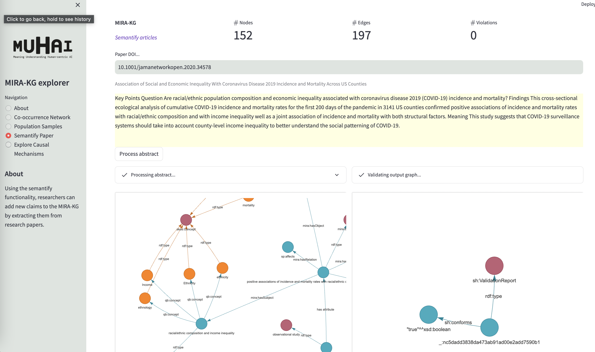

# MIRA-editor - A Digital Assistant for the MIRA-KG, a Knowledge Graph of Social Demography Hypotheses and Findings.

This github presents the MIRA-editor, a digital assistant aiding researchers in understanding the trends and patterns revealed in social demography, and use them to discover biases, discover knowledge, and derive novel questions.

## Table of Contents
- [Overview](#overview)
- [Getting Started](#getting-started)
- [Prerequisites](#prerequisites)
- [Usage](#usage)
- [Contributing](#contributing)
- [License](#license)
- [Acknowledgments](#acknowledgments)

## Overview





### Prerequisites

1. clone the project
```
git clone https://github.com/muhai-project/mira-editor.git
```

2. set up an environment (like anaconda) from the requirement.txt file (NOT AVAILABLE YET)
```
pip install -r requirements.txt
```

### Usage

## License

This project is licensed under the [Creative Commons Attribution-ShareAlike 4.0 International License](https://creativecommons.org/licenses/by-sa/4.0/).

## Acknowledgments
This work was funded by the European MUHAI project (Horizon 2020 research and innovation program) under grant agreement
number 951846. We thank Tobias Kuhn and Inès Blin for the insightful discussions that contributed to this work.

---
